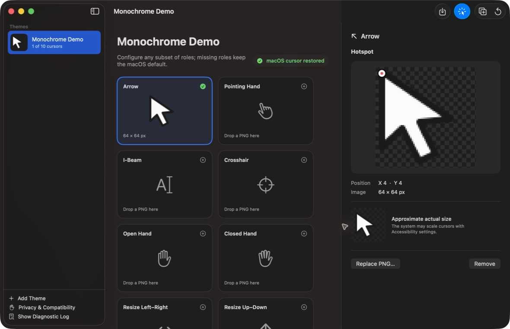

# Cursor Studio

> [!WARNING]
> Cursor Studio uses unsupported private macOS CoreGraphics cursor APIs.
> It works on the macOS version on which this repository was validated, but
> compatibility with future macOS releases is not guaranteed. It is not
> suitable for the Mac App Store.

Cursor Studio is a native SwiftUI app for building and applying local system
cursor themes. It changes the real global cursor registered with WindowServer;
it does not draw an overlay, hide the pointer, poll mouse coordinates, or use
Accessibility to move the cursor.



## Current version

- Cursor Studio 1.9.
- Native Swift 6 and SwiftUI interface for macOS 15 or later.
- Local theme library with create, rename, duplicate, and delete.
- Partial themes: roles with no custom image continue using macOS defaults.
- PNG, Mousecape `.cape`, Windows `.cur`, Windows `.ani`, Windows cursor
  folders, and ZIP theme import from the same file picker or drag and drop.
- Portable `.cursorstudio-theme` export and import preserves every configured
  role, hotspot, point size, Retina representation, animation, and author.
  Shared themes use the same hardened package validator as Marketplace.
- Imported files are validated, re-encoded, and copied into Application
  Support under collision-resistant names.
- Transactional `.cape` review with role mapping, Retina representations,
  hotspots, author metadata, animation timing, warnings, and preserved
  unassigned entries.
- Animated Mousecape cursors with up to 24 frames are registered as animations;
  larger animations retain their metadata and use a clearly marked first-frame
  fallback.
- Live animated previews in the theme grid and inspector for Mousecape,
  Windows ANI, and Marketplace themes, with Reduce Motion support.
- Theme quality badges show configured roles, animations, and static fallbacks
  at a glance.
- Contextual native sidebar navigation for the local Library and Marketplace,
  with one toolbar search field that adapts to the current section.
- Marketplace detail sheets validate the installable package and preview every
  included static or animated cursor before installation.
- System Settings-style preferences for general behavior, cursor recovery,
  Marketplace, privacy, and app information.
- Windows CUR hotspots and multi-resolution representations are preserved.
  RIFF ACON/ANI timing and frame order use the same animation-strip format as
  `.cape`.
- Cached theme preview icons generated from Arrow, another imported cursor, or
  a native placeholder.
- Visual normalized hotspot editor with transparency grid, coordinates,
  original dimensions, and an approximately actual-size preview.
- Global Apply and Restore macOS Cursor actions.
- Optional persistent mode that leaves the applied cursor registered after
  quitting; Launch at Login reapplies it after a Mac restart.
- Event-driven reapplication after wake, display/accessibility display changes,
  and returning to the app.
- Local rotating diagnostic log.
- Original, locally generated Monochrome Demo theme.
- No mandatory account, analytics, helper daemon, root
  privileges, SIP changes, or protected-system-file modifications.

SVG is recognized by the import layer but intentionally reports
“SVG import is not available in this build.” Native macOS SVG decoding is not
reliable enough for the MVP.

## Build and run

Requirements:

- macOS 15 or later
- Xcode 26 or a compatible Swift 6 Xcode release
- Apple Silicon or Intel Mac

Open `Cursor Studio.xcodeproj`, select the **Cursor Studio** scheme and
**My Mac**, then press Run. The project uses an ad-hoc local identity and has
automatic signing, hardened runtime, and App Sandbox disabled. An Apple
Developer Program membership is not required.

Command-line build:

```sh
DEVELOPER_DIR=/Applications/Xcode.app/Contents/Developer \
  xcodebuild \
  -project "Cursor Studio.xcodeproj" \
  -scheme "Cursor Studio" \
  -configuration Debug \
  -derivedDataPath .build \
  CODE_SIGNING_ALLOWED=NO \
  ENABLE_USER_SCRIPT_SANDBOXING=NO \
  build
```

Run unit tests:

```sh
DEVELOPER_DIR=/Applications/Xcode.app/Contents/Developer \
  xcodebuild \
  -project "Cursor Studio.xcodeproj" \
  -scheme "Cursor Studio" \
  -configuration Debug \
  -derivedDataPath .build \
  CODE_SIGNING_ALLOWED=NO \
  ENABLE_USER_SCRIPT_SANDBOXING=NO \
  test
```

XCTest must be able to communicate with macOS `testmanagerd`; heavily
sandboxed shells can compile the suite but may be unable to launch it.

## Using Cursor Studio

1. Create or select a theme.
2. Select a cursor role.
3. Drop a PNG onto the role card, or import a `.cape`, `.cur`, `.ani`,
   `.cursorstudio-theme`, Windows theme folder, or ZIP to create a new theme.
   Review mapped roles, unassigned roles, and warnings before committing it.
4. Click the enlarged image to set its hotspot.
5. Choose **Apply Theme**. The active theme is reapplied while Cursor Studio is
   open.
6. Choose **Restore macOS Cursor** at any time to remove all custom
   registrations. Restore does not require the imported theme to still exist.

To share a local theme, select it and choose **Export Theme…** from the
toolbar, its sidebar context menu, or the File menu. The recipient imports the
result through the normal Import command and reviews it before adding it to
their library.

Theme data is stored in:

```text
~/Library/Application Support/Cursor Studio/
```

The main window may be closed without restoring the cursor. Deleting the active
theme, a partially failed Apply operation, or corrupted active-theme data
triggers a restoration attempt.

## Privacy and diagnostics

Cursor Studio is entirely local. Cursor images never leave the Mac, no account
is required, and no analytics are collected. **Cursor Studio → Settings →
Compatibility** can reveal the diagnostic log in Finder. The log records only the
macOS version, operation, cursor role, timestamp, and error text; it never
records image contents or source document paths and is capped at roughly
512 KB.

## Known limitations

Private cursor symbols and identifiers may change in any macOS update. SVG
remains unsupported and animations above 24 frames use a static fallback. See
[KNOWN_LIMITATIONS.md](KNOWN_LIMITATIONS.md) for the complete compatibility
and import feature matrix.

Global cursor replacement is validated manually because XCTest must not mutate
a developer's live pointer. The repeatable workflow and results are in
[Documentation/STABILITY_TESTING.md](Documentation/STABILITY_TESTING.md).

See [Documentation/PRIVATE_CURSOR_API.md](Documentation/PRIVATE_CURSOR_API.md)
for the implementation boundary and validation evidence, and
[ProofOfConcept/README.md](ProofOfConcept/README.md) for the standalone
technical proof.

## License and attribution

Cursor Studio's original source is available under the MIT License. Mousecape
was used as an attributed research reference for private API names and the
overall feasibility of non-overlay cursor registration; its source was not
copied into this project. See [THIRD_PARTY_NOTICES.md](THIRD_PARTY_NOTICES.md).
